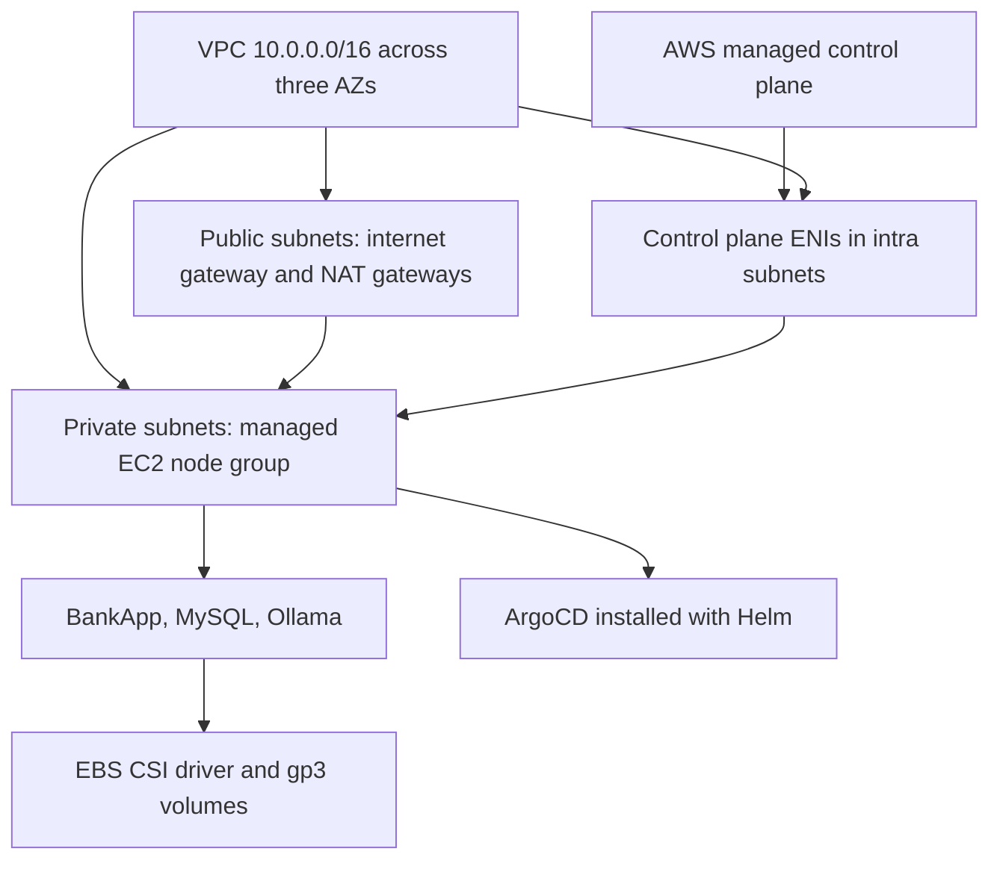

# Day 81 - Amazon EKS with Terraform

## Execution status
Terraform configuration was reviewed, initialized without a backend and validated locally. AWS STS returned NoCredentials. No EKS cluster, AWS nodes, volumes or public ArgoCD endpoint was created. Cluster screenshots and application access evidence remain pending.

Reference source: AI-BankApp-DevOps, feat/gitops, commit d37fe11f2e754fee6d5857cd19d183ba9fdf0c7d. The seven Terraform source files and defaults are included in terraform/; provider selections are recorded in its lock file.

## Architecture

Managed Kubernetes transfers control-plane maintenance and availability to AWS. With managed node groups AWS also manages node provisioning and update mechanisms; the operator still selects capacity, schedules upgrades and manages workloads. Fargate removes EC2 node administration for supported workloads, with different storage and scheduling constraints.

## Configuration review
| File | Actual responsibility |
| --- | --- |
| provider.tf | Terraform >= 1.5.7, AWS 6.x and Helm 2.x; three available AZs; subnet CIDRs; Helm authenticates with aws eks get-token. |
| variables.tf | Inputs for region, cluster version/name, instance type and desired/max nodes. |
| terraform.tfvars | Lab defaults: us-west-2, bankapp-eks, Kubernetes 1.35, t3.medium, three desired and five maximum nodes. |
| vpc.tf | VPC module 6.x; public, private and intra subnets; ELB discovery tags; NAT enabled. |
| eks.tf | EKS module 21.x; public/private endpoints; managed nodes; creator admin access; six add-ons; EBS CSI service-account IRSA role. |
| argocd.tf | ArgoCD Helm release after EKS, LoadBalancer service, server.insecure=true. TLS and endpoint restrictions need attention before public use. |
| outputs.tf | Cluster/network identifiers and kubeconfig/password helper commands; CA output marked sensitive. |

CoreDNS resolves service names; kube-proxy implements service forwarding; VPC CNI assigns pod networking; Pod Identity agent supports IAM associations; EBS CSI provisions/attaches storage; metrics-server serves resource metrics for HPA. Installing Pod Identity does not itself grant pod permissions. The EBS driver in this source uses IRSA.

A node group's max_size is a limit, not an installed node autoscaler. Three desired instances do not guarantee exactly one node in each AZ; check actual topology labels. Kubernetes version and instance capacity must be checked in the target region before applying.

## Cost and cleanup
| Component | Cost driver |
| --- | --- |
| EKS | Cluster support tier and running hours |
| EC2 | Region, instance type, count and running hours |
| NAT | Number of gateways, hourly charges and processed bytes |
| EBS | Provisioned capacity, IOPS/throughput and snapshots |
| Load balancers | Type, running hours and capacity/data processing |
| Network | Internet/inter-AZ transfer |

The README's approximate $220/month is not a quote or measured bill. The VPC source enables NAT without single_nat_gateway=true; the module can create multiple gateways, so a one-NAT budget can undercount. NAT charges continue while idle and include processed data. See [AWS EKS pricing](https://aws.amazon.com/eks/pricing/) and obtain a regional estimate before apply.

Delete Kubernetes-created load balancers and PVCs before Terraform destroy, check volume reclaim policies/backups, then verify the exact lab resources in AWS. No AWS teardown was needed in this run; absence of credentials prevents checking pre-existing AWS resources.

## Validation and remaining work
terraform validate passed with a deprecated AWS region name attribute warning inside the upstream IAM module. The upstream lock selected AWS 6.40.0, conflicting with newer module constraints; the local copy initialized with a new compatible lock. Formatting was normalized only in this day's Terraform files.
Pending: AWS plan/apply, three Ready nodes, system add-ons, EBS binding, full app login/chatbot, ArgoCD external access and AWS teardown verification.
