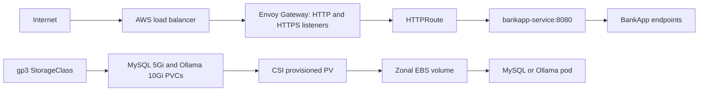

# Day 82 - Gateway API and EBS Storage

## Architecture

The load balancer type depends on the AWS service controller and its configuration. Creating Gateway resources alone does not guarantee an NLB. A Kind LoadBalancer service normally remains without an external address.

| Concern | Ingress | Gateway API |
| --- | --- | --- |
| Responsibility | One routing resource | GatewayClass for infrastructure, Gateway for listeners, HTTPRoute for app routes |
| Matching | Basic host/path routing, controller extensions | Standard header/path matching and weighted backends |
| TLS | Ingress Secret references | Gateway TLS listeners and certificate references |
| Affinity | Controller-specific extensions | Envoy BackendTrafficPolicy is still implementation-specific |
| Version | Stable Kubernetes API | GatewayClass/Gateway/HTTPRoute reached v1 in Gateway API 1.0 independently of a Kubernetes minor release |

[Gateway API versioning](https://gateway-api.sigs.k8s.io/docs/concepts/versioning/) describes the independent API lifecycle.

## Supplied configuration
gateway.yaml includes the controller class, gateway, route and cookie affinity policy. bankapp.example.com is a placeholder: replace both listener and route hostnames with a domain you control. cluster-issuer.yaml uses the Let's Encrypt staging endpoint and operator@example.com; replace the email before use. Staging certificates are not browser-trusted.

GatewayClass selects Envoy's controller. Gateway creates HTTP/HTTPS listeners and references bankapp-tls. HTTPRoute attaches to those listeners and forwards to the service. BackendTrafficPolicy uses BANKAPP_AFFINITY with a one-hour lifetime. Envoy can route directly to endpoints, so Service ClientIP affinity alone does not preserve Spring Security sessions. Cookie affinity reduces cross-pod session loss but cannot preserve an in-memory session after its pod dies.

Install Gateway API CRDs before enabling cert-manager Gateway support. Set config.enableGatewayAPI=true. The HTTP listener must accept the challenge route; DNS and public port 80 must be reachable. cert-manager creates a challenge route, validates domain ownership and stores the certificate in a Secret. See [cert-manager Gateway integration](https://cert-manager.io/docs/usage/gateway/). An NLB hostname cannot simply be suffixed with nip.io; that service expects an IP-based hostname.

## Storage and capacity
storage.yaml supplies gp3 with WaitForFirstConsumer, Delete reclaim policy and expansion, plus the two PVCs. EBS volumes are zonal and generally attach to one node for ReadWriteOnce. RWO is not a strict one-pod guarantee when pods share a node. Recreate avoids simultaneous replacement pods competing for the same attachment.

| Workload | CPU request | Memory request | Count from exercise |
| --- | --- | --- | --- |
| BankApp | 250m | 256Mi | 2-4 |
| MySQL | 250m | 256Mi | 1 |
| Ollama | 900m | 2Gi | 1 |
| System workloads | Measure actual values | Measure actual values | Per node |

At four BankApp replicas, application CPU requests total 2150m before system overhead. Three t3.medium nodes provide nominal 6 vCPU/12Gi, but allocatable resources are lower. Measure node allocatable capacity and pod requests before scheduling monitoring.

## Evidence and limits
Envoy Gateway v1.4.0 was installed on the isolated Kind lab. Local Gateway routing and policy validation are recorded in validation.md. EKS NLB creation, trusted HTTPS, EBS provisioning, storage persistence and HPA behavior remain pending because there are no AWS credentials.
Local Kind storage must not be described as EBS. Production manifests retain gp3 rather than silently replacing the EKS exercise with local storage.
