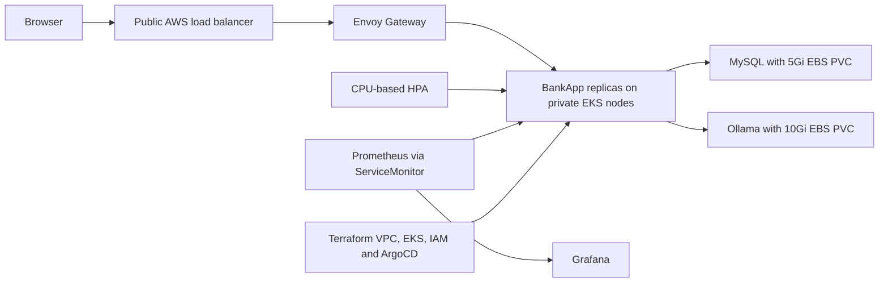

# Day 83 - EKS Project

## System design


## Monitoring artifacts
bankapp-service.yaml adds app=bankapp to the Service metadata and names its port http. bankapp-servicemonitor.yaml selects that label, targets the bankapp namespace and scrapes /actuator/prometheus every 15 seconds. The ServiceMonitor endpoint port must match a Service port name; the upstream Service has an unnamed 8080 port and no metadata label, so the README example would not select a target as written.

monitoring-values.yaml uses an existing private Grafana credential Secret and three-day Prometheus retention. Create monitoring-grafana-admin privately before deployment. No password is stored in these files.

Useful queries:
```promql
sum(jvm_memory_used_bytes{namespace="bankapp"}) by (pod)
sum(rate(http_server_requests_seconds_count{namespace="bankapp"}[5m])) by (pod)
histogram_quantile(0.95, sum(rate(http_server_requests_seconds_bucket{namespace="bankapp"}[5m])) by (le))
```
The latency query requires histogram buckets to be enabled in the app. An empty result is not evidence of zero latency.

## End-to-end checklist
| Check | This run |
| --- | --- |
| EKS node readiness and allocatable capacity | Blocked: no AWS credentials |
| MySQL database and EBS PVC | EKS pending; local chart checked separately |
| Ollama TinyLlama model and chatbot | EKS pending |
| Login, deposit, withdrawal, transfer, theme | Pending real EKS browser session |
| Gateway HTTP and HTTPS | Local HTTP tested separately; EKS/TLS pending |
| HPA metrics and scaling | EKS pending |
| Prometheus ServiceMonitor target and Grafana dashboards | Configuration prepared; runtime evidence in validation.md |
| Container user and secret handling | Runtime EKS checks pending |
| Load balancer/volume release and terraform destroy | No AWS resources created by this task |

Counting password keys in a Secret does not prove environment confidentiality. Avoid printing Secrets, inspect references and RBAC, and verify non-root securityContext and the running process identity. Ordinary Kubernetes Secret data is base64 encoding, not encryption.

## Teardown and cost report
Stop port forwards; remove lab monitoring and Gateway resources; wait for cloud load balancers to be deleted. Back up required database data before deleting PVCs (gp3 reclaimPolicy is Delete). Destroy only the reviewed Terraform state. Check for Kubernetes-created orphan volumes/load balancers and ongoing NAT/EC2/EKS charges.

AWS execution cost for this task: no resources were provisioned. Existing account costs cannot be verified without credentials. The README's $15-25 estimate is not a measured bill.
Takeaway: validation must cover data, readiness, routing and monitoring together; a successful apply is insufficient evidence of a working application.
