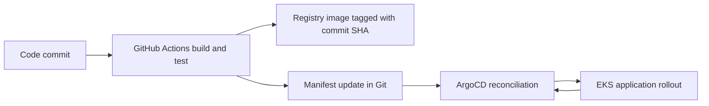

# Day 84 - GitOps and ArgoCD

GitOps stores declarative desired state in version control, pulls it automatically and continuously reconciles it with the cluster. [OpenGitOps principles](https://opengitops.dev/) define declarative, versioned/immutable, automatically pulled and continuously reconciled state.

| Concern | Push deployment | GitOps |
| --- | --- | --- |
| Deployment | CI applies manifests | Controller pulls desired manifests |
| Credentials | CI requires cluster access | CI requires registry/Git access; controller holds cluster access |
| Drift | Requires extra detection | Controller compares desired/live state |
| Rollback | Pipeline/manual action | Revert desired state in Git |
| Audit | Pipeline plus source history | Source history plus controller events |

## Application fields
application.yaml reflects the EKS reference. Update its source to a reviewed personal fork before changing desired state. Do not deploy upstream plaintext credentials or the fixed upstream TLS hostname unchanged.

| Field | Effect |
| --- | --- |
| metadata.namespace=argocd | Stores the Application in the controller namespace |
| project=default | Uses default source/destination permissions |
| repoURL/targetRevision/path | Fetches feat/gitops and renders k8s |
| destination.server | Targets the in-cluster Kubernetes API |
| destination.namespace | Targets bankapp |
| automated | Allows reconciliation to deploy changes |
| prune | Removes managed objects deleted from Git; can delete data-bearing resources |
| selfHeal | Reconciles managed live drift back to Git |
| CreateNamespace | Creates the destination namespace |
| ServerSideApply | Uses server-side field ownership; does not eliminate every ownership conflict |
| resources finalizer | Cascading Application deletion removes managed workloads |

Sync and health are separate: Synced does not mean every Pod is Ready. Init containers enforce dependencies; file order alone does not order raw resources.

## Local exercise
local-application.yaml pulls the existing day-80 Helm chart from AFarinha/90DaysOfDevOps master. It uses dev values and disables Ollama to keep this focused on GitOps. This is a Kind alternative, not the expected EKS deployment. Random credentials are generated privately by create-lab-secret.py.

validation.md records the actual controller status and any self-healing experiment. The existing devops-cluster was not used for the exercise.

## Drift experiments
For a disposable app, compare desired/live state before and after a manual scale, ConfigMap deletion and data change. Record elapsed detection/recovery and controller events. HPA and ArgoCD can both write replicas; avoid treating an HPA correction as proof of ArgoCD self-healing. Do not run destructive drift exercises on an active database namespace.
