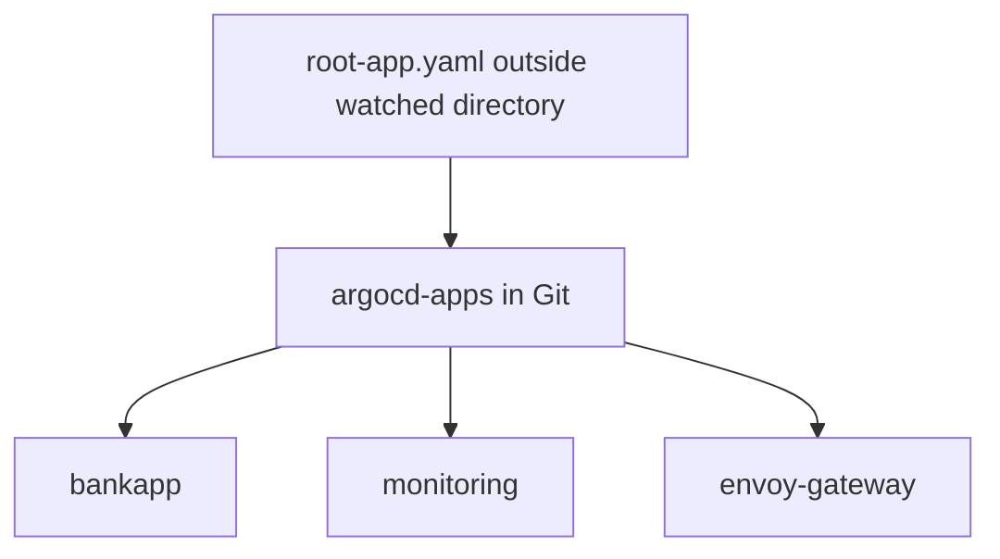

# Day 85 - ArgoCD Sync, Rollback and Multi-App Management

## Sync strategies and ordering
Automated sync suits environments where reviewed Git changes may deploy immediately. Manual sync retains drift visibility while requiring an operator to approve deployment. Use dry-run/diff before a real sync. Selective sync omits hooks, so it must not be used as proof of a complete hook-driven deployment.

| Wave | Resources | Reason |
| --- | --- | --- |
| -2 | Namespace and gp3 StorageClass | Infrastructure first |
| -1 | ConfigMap and Secret | Configuration before workloads |
| 0 | PVCs, MySQL/Ollama Deployments and Services | PVC consumers must be created with WaitForFirstConsumer claims |
| 1 | BankApp Deployment | Wait for dependency health |
| 2 | HPA | Enable scaling after application creation |

The README places PVCs in wave -1 and consumers in wave 0. With WaitForFirstConsumer, a PVC may stay Pending until its consumer exists and prevent wave advancement. The preparation script puts PVCs and their consumers in the same wave. [ArgoCD waves](https://argo-cd.readthedocs.io/en/stable/user-guide/sync-waves/) describes health-gated ordering.

## Rollback
ArgoCD rollback deploys a previously synced revision without changing Git. Disable automated sync first; otherwise rollback is disallowed or desired state will restore the current revision. git revert creates a reviewed new commit that restores the previous desired configuration and preserves the audit trail. See [automated sync restrictions](https://argo-cd.readthedocs.io/en/stable/user-guide/auto_sync/).

## App of Apps

Keeping root-app.yaml outside argocd-apps avoids the parent managing itself. Child Applications have cascading finalizers. Publish reviewed child manifests before applying the root: the configured path is not available remotely until then. Each child syncs independently; a parent wave is not automatically a readiness barrier for child workloads.

The monitoring child uses a private pre-existing Grafana Secret. The Envoy child uses the OCI chart registry without an oci:// prefix in ArgoCD repoURL. The bankapp child initially points to the reference repo; change it to a sanitized fork before application deployment.

## Notifications
notifications.yaml defines success/failure/degraded triggers, actual webhook templates and a delivery service using $lab-webhook-url from a private Secret. Subscribe the Application to the named lab webhook. No external messages were sent. A sync operation message is not notification delivery history; inspect notifications-controller logs and the receiver response.

## Projects and RBAC
project-rbac.yaml allows the reference source, bankapp destination and the namespace/StorageClass kinds needed by this stack. The developer project role permits applications get/sync. It grants no update/delete permissions. ArgoCD rollback is not a separate RBAC action; controlling application sync/update and approval policy is necessary to restrict deployment of older revisions.

An administrator adding kube-system as a project destination is changing policy, not testing policy enforcement. Test a forbidden Application destination or an operation as the restricted identity instead. Verify SSO group claims and global default policies before claiming tenant isolation.

Runtime App of Apps, notifications delivery and restricted-user tests remain pending. API schema validation and the local sync strategy checks are recorded in validation.md.

Cluster-scoped Namespace and StorageClass permissions are kind-wide, not a name-level isolation boundary. In a real multi-team setup, place shared cluster resources under a separate infrastructure project and tighten workload permissions. This lab project is prepared for the reference stack and was not verified as a complete tenancy boundary.
