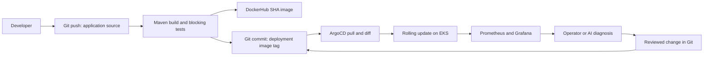

# Day 86 - Complete GitOps Pipeline

## Workflow
gitops-ci.yml is adapted from the reviewed upstream workflow. It belongs in .github/workflows/gitops-ci.yml of the AI-BankApp fork, not this challenge repository's root.

| Step | Purpose |
| --- | --- |
| Source path filters | Trigger on feat/gitops application changes and manual dispatch |
| Checkout and JDK 21 | Obtain source and configure Maven |
| Build | Produce package, then run tests explicitly |
| Test | Fail publication when tests fail; upstream continue-on-error was removed |
| Tag | Use short Git SHA for traceability |
| DockerHub login | Read DOCKERHUB_USERNAME and DOCKERHUB_TOKEN Secrets |
| Buildx/build-push | Publish latest and SHA tags with GitHub cache |
| Manifest update | Replace the configured image repository's tag |
| Bot commit/push | Write desired deployment state back to the branch |

Set repository variable DOCKERHUB_REPO to your owned registry repository and add the two Secrets privately. contents:write permits the bot commit subject to branch protections. Image publishing has not run. The existing path filters already exclude manifest-only commits; [skip ci] provides another push-workflow skip mechanism. Configure serialization/rebase handling before allowing concurrent runs to race on Git updates.

## Drift and release evidence
| Scenario | Expected behavior | EKS result |
| --- | --- | --- |
| Manual scale | Controller/HPA interaction must be attributed correctly | Pending |
| Wrong image | selfHeal restores image from desired Git state | Pending |
| Deleted service | Controller recreates managed service | Pending |
| Git source change | CI -> immutable image -> manifest -> ArgoCD rollout | Pending DockerHub and EKS setup |

Local GitOps evidence is recorded in day-84/validation.md. No successful Actions run, bot manifest commit, EKS rollout or zero-downtime guarantee is claimed. Probe configuration, capacity, rollout strategy and dependency availability determine actual downtime.

## Complete teardown
Disable the parent's automated reconciliation before deleting children, or root-app can recreate them. Delete reviewed Applications with cascading deletion, inspect remaining services/PVCs, then destroy the exact Terraform state. Wait for cloud controllers to release load balancers before deleting the cluster.

No AWS resources or published images were created here. The disposable local cluster and containers are cleaned up after local checks; the original cluster is preserved.

## Connection to the challenge
Linux/networking make the environment usable; shell and Git automate/review changes; Docker packages code; Actions builds/tests; Terraform provisions infrastructure; Helm renders configuration; ArgoCD reconciles it; observability supplies evidence; AI may assist diagnosis under approval and scope limits.
