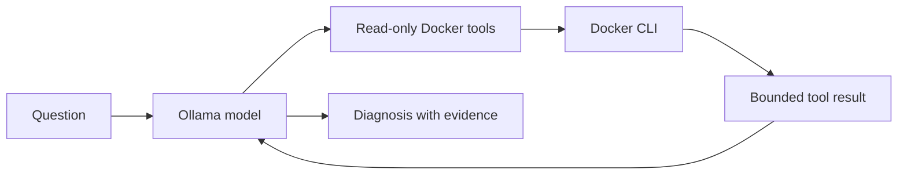

# Day 87 - Agentic AI for DevOps

## Design
An explainer makes one model call and returns text. An agent has tools, receives their results and may choose another tool before answering. Tool-call decisions must be distinguished from a human manually running the same commands.

For the controlled broken container, list_containers shows its status, get_logs shows app-starting and inspect_container shows an exit code of 1 plus the entry command. The error is the deliberate exit, not nginx itself. The README's docker run lacks a restart policy; this lab uses on-failure:5 so repeated restart behavior is actually reproducible.

## Implemented files
explainer.py keeps the three-part Docker system prompt. agent.py uses the current LangChain create_agent API with a bounded recursion limit. devops_tools.py adds list_images and uses argument arrays, timeouts, resource-name validation and bounded output. inspect_container avoids environment variables. Restart is deliberately omitted from this diagnostic exercise; any mutating tool would require explicit target scope and approval.

The local model defaults to gemma4 and can be selected with OLLAMA_MODEL. Ollama runs in a loopback-only disposable Docker container; its model cache is stored in ignored .runtime/models. Dependencies are isolated in .venv and verified with pip check.

A system prompt controls scope, expected evidence and response format. Lower temperature usually reduces output variability but does not guarantee deterministic or correct answers. Prompt comparisons should use the same error and record actual model responses.

## Evidence
validation.md records setup, the model pull result, explainer output and actual tool selections. The reference preflight expects an ollama host executable; using docker exec is an intentional containerized alternative.
Source reference: agentic-ai-for-devops commit 5f328ff30333709ee3e2cb7aaae847a34108faa8.

## Safety and cleanup
Only diagnostics are available. Logs remain untrusted and may contain sensitive data; sanitize them before using tools against production. Remove days87-broken and days87-ollama after the exercise; keep source/dependencies/model cache only in ignored directories.

The prompt experiment used the same error at temperature 0.3. A two-bullet inspection-first instruction shortened the response but introduced an inaccurate "stale image" suggestion. Review tool evidence and proposed commands even when the model follows the requested format.
