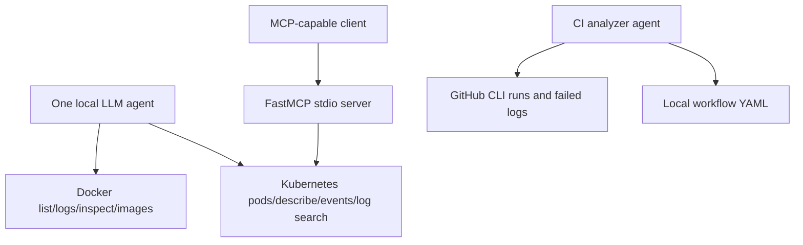

# Day 88 - Multi-Tool Agents, MCP and CI Diagnosis

## Architecture

The baseline contains three Docker and three Kubernetes diagnostics. This implementation also includes list_images from Day 87 and search_logs as the Day 88 custom tool. Kubernetes tools force the disposable cluster context and lab namespace.

MCP separates server implementation from tool discovery and client use. mcp_server.py registers plain functions behind the LangChain tools with FastMCP. mcp_client.py discovers those functions through langchain-mcp-adapters; the LLM still decides which tool to call. stdio starts a local subprocess; HTTP requires a separate server transport and appropriate access control.

validate-mcp.py independently validates real protocol discovery and invocation without pretending that an LLM chose the calls. Its assertions verify the registered names, pod crash evidence and literal log search.

## CI analyzer
ci_analyzer.py lists failed runs, fetches bounded failed-step logs and reads workflow files from the current working directory. CI_REPOSITORY selects the GitHub repo; default is AFarinha/90DaysOfDevOps. Workflow names reject path traversal and run IDs must be numeric. Run from the target application's checkout to read its workflows.

No deliberately failing workflow was published simply to manufacture evidence. Existing failures can be inspected read-only. validation.md distinguishes the GitHub CLI result from any LLM diagnosis.

## Reusable tool pattern
Use a specific docstring, argument-list subprocess execution, input validation, a timeout, a bounded result and visible exit status. A tool returning an error must not be interpreted as successful evidence. Tool output is untrusted input to the model.

## Results and limits
The controlled broken-pod produced repeated exit-code failures; MCP discovery and calls were executed against it. Exact output and model behavior are in validation.md. Tools are restricted locally but this demonstration is not a complete production authorization system.
Cleanup removes the dedicated cluster and lab containers; existing Docker containers and the original devops-cluster are preserved.
