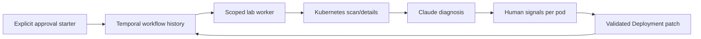

# Day 89 - KubeHealer and AIOps

## Architecture and guardrails

| Guardrail | Lab implementation or remaining limitation |
| --- | --- |
| Human approval | start-with-approval.py sends auto_approve=False; explicit per-pod approve/reject signals |
| Scope limits | Dedicated kubeconfig/context and days89-lab; fix targets restricted to fixture names |
| Audit trail | Real Temporal workflow/activity history; output kept private |
| Reversibility | Redeploy reviewed fixture specs; back up real data before production remediation |
| Timeout/retries | Upstream activity deadlines and diagnosis max three attempts; not a global workflow deadline |
| Escalation | Missing ConfigMap fixture is skipped, not fabricated |

## Reference discrepancies
Reviewed kubehealer commit: 2a39844b61bbf527ad63751e35fef17ea3fb31f6.
The upstream starter.py uses auto_approve=True. Its image/resource fixes patch an owning Deployment, not standalone Pods. The lab uses Deployments and an actual Python memory allocation above the limit; a shell sleeping under a 1Mi limit is not a reliable reproducible memory-pressure workload.

The scanner can report the same Pending pod both for its container failure and StuckPending. lab_activities.py deduplicates by namespace/name and constrains corrections to known lab images and memory sizes. These are local adapters; the upstream repository is not changed remotely.

## Broken applications
| Workload | Observed fault before fixes | Intended correction |
| --- | --- | --- |
| web-app | ImagePullBackOff for ngnix:latest | Known nginx image |
| memory-app | OOMKilled from 100Mi allocation with 32Mi limit | 256Mi limit |
| config-app | CreateContainerConfigError, missing app-config | Escalate; retain failure |

## Validation boundaries
The Kubernetes failures and Temporal orchestration were run for real. validate-durability.py replaces only Claude diagnosis with an explicitly deterministic test fixture. It kills a worker during diagnosis after one completed activity, starts a new worker, checks replay reuses the completed diagnosis, checks that fixes have not run before approval, then sends test approval/rejection signals and exercises real scoped Deployment patches.

This is evidence of crash recovery, the approval gate and Kubernetes remediation mechanics. It is not evidence that Claude diagnosed the failures. ANTHROPIC_API_KEY was not configured, so the complete Claude workflow remains pending. No secret or invented AI response is included. Actual results are in validation.md.

Temporal replays workflow code using recorded activity results; completed external calls are not normally repeated by workflow replay. An in-flight activity can be retried after a crash, so mutations must be idempotent and verified. History persistence is essential: killing a worker is different from losing an in-memory dev server.

## AI or conventional automation?
Use fixed automation for known scaling/restart conditions. Use model-assisted diagnosis for ambiguous symptoms with multiple possible causes. Require evidence and approval before mutations. Docker/Kubernetes/GitHub tools reuse earlier skills; metrics/logs/traces can supply evidence; GitOps desired-state changes should go through Git to prevent reconciliation undoing direct patches.

Cleanup stops the task's Temporal/Ollama services and removes only the disposable cluster. A local dev server is not a production durable database.
