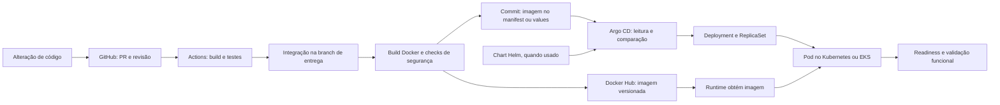
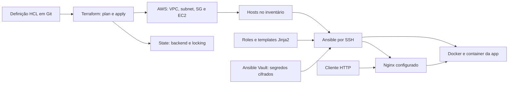
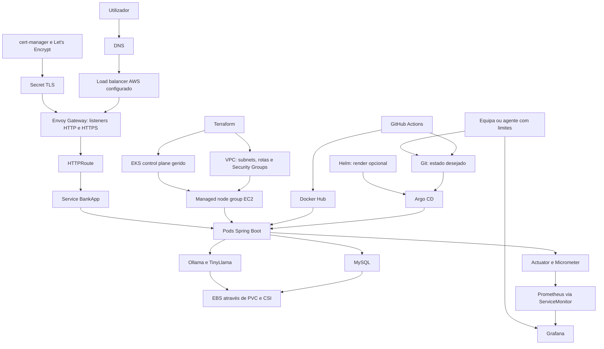
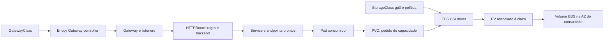
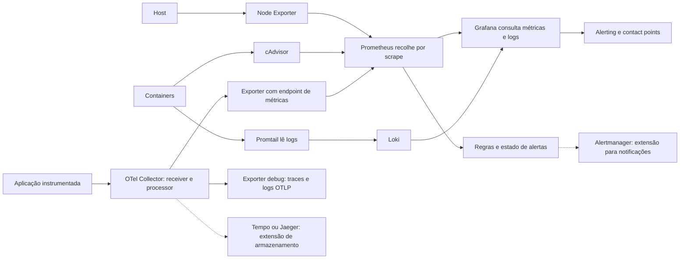
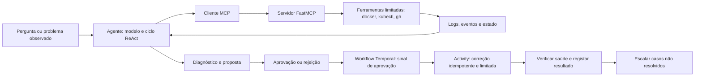

# Arquitetura e fluxos completos

[Entrada do guia](README.md) · [Conceitos](concepts.md) · [Índice](day-index.md)

As setas indicam produção, consulta, controlo ou tráfego conforme a legenda. Os desenhos combinam responsabilidades ensinadas em dias diferentes; não afirmam que todos os componentes foram executados juntos na AWS.

## 1. Do código até produção por GitOps

**Fontes:** dias 45, 49, 80 e 84-86. O registry transporta imagens; Git transporta a referência da versão desejada; Argo CD reconcilia a configuração. A pipeline de referência do dia 86 usa manifests; Helm é a integração alternativa desenvolvida nos dias 79-80.

**O que verificar em cada passagem:** testes bloqueantes; scan da imagem correta; publicação no registry pretendido; referência consistente no Git; sync e health separados; resposta funcional e dados corretos. Tags não são garantias de imutabilidade. O job demonstrativo do dia 48 e testes tolerados no exemplo do dia 86 são limites explicitados nas fontes locais.

## 2. Provisionamento e configuração de uma VM

**Fontes:** dias 61-72. Terraform gere recursos; Ansible prepara o sistema; Nginx recebe o tráfego externo e faz reverse proxy para a porta da app.

A VM tem de existir e ser acessível antes de Ansible a configurar. Inventário, credenciais SSH e permissões de become fazem parte dessa ligação. State sensível e chave do Vault têm de ter acesso controlado. Este fluxo é uma opção completa de entrega; não precisa de EKS ou Argo CD para funcionar.

## 3. Arquitetura consolidada da AI-BankApp

**Fontes:** dias 79-86, com observabilidade dos dias 73-77/83. Plano de controlo é distinto do percurso do tráfego. O control plane EKS é gerido pela AWS; os workloads executam nos worker nodes ligados à VPC do utilizador.

A seta Nodes → App significa local de execução; não pedido HTTP. O percurso de tráfego não atravessa Terraform nem Argo CD. As duas workloads persistentes usam volumes distintos; o nó Disco agrega apenas o mecanismo.

**Responsabilidades que faltam num desenho simples:** políticas IAM/RBAC, secrets, DNS/TLS válidos, backups, capacidade e proteção de sessões. Afinidade não elimina perda de sessão após falha do Pod. Instalar monitorização exige capacidade adicional.

## 4. Rede Kubernetes e armazenamento EBS

**Fonte:** dias 53-56 e 82. O controlador implementa routing; o driver CSI liga claims a volumes reais. Um LoadBalancer Service depende da implementação cloud; Gateway não garante por si só um NLB.

WaitForFirstConsumer adia provisionamento até conhecer colocação do consumidor. Não colocar essa claim numa sync wave que só avança depois de Bound se o consumidor está numa wave posterior. Retain/Delete define o destino do armazenamento quando libertado; não é política de backup.

## 5. Observabilidade: três percursos distintos

**Fontes:** dias 73-77. As setas representam movimento/consulta dos dados; Prometheus faz pull dos endpoints, enquanto OTLP e o envio de logs são push.

As setas tracejadas são extensões propostas, não serviços integrados no laboratório base. A stack completa inclui Notes App, Prometheus, Node Exporter, cAdvisor, Grafana, Loki, Promtail e Collector. Os snapshots locais podem ter mais targets por incluírem a app como endpoint direto.

## 6. Diagnóstico, MCP e remediação durável

**Fontes:** dias 87-89. MCP uniformiza ferramentas; Temporal preserva progresso; o modelo interpreta resultados. O controlo de execução permanece fora das decisões livres do modelo.

No KubeHealer, Temporal coordena scan, diagnóstico e espera de aprovação desde o início; o sinal permite avançar para a activity de correção. Este diagrama reúne padrões dos três dias: não afirma que KubeHealer usa obrigatoriamente MCP. No dia 88 MCP serve ferramentas; no dia 89 Temporal coordena o percurso de remediação. O laboratório Temporal local usa diagnóstico simulado para testar durabilidade/aprovação, separadamente do desempenho de Claude.

## Contratos a memorizar

| Fronteira | Contrato |
| --- | --- |
| Fonte → build | Dependências e instruções reprodutíveis |
| Build → registry | Artefacto identificado e verificado |
| Registry → Git desejado | Referência da imagem efetivamente publicada |
| Git → Argo CD | Fonte/path/revisão e permissões corretas |
| Controller → workload | Ownership e estratégia de reconciliação |
| Workload → armazenamento | Claim, classe, zona e política de dados |
| Workload → tráfego | Porta, readiness, endpoints e routing |
| Telemetria → equipa | Dados interpretáveis, alerta entregue e runbook |
| Proposta → ação | Âmbito, aprovação, auditoria e verificação |
