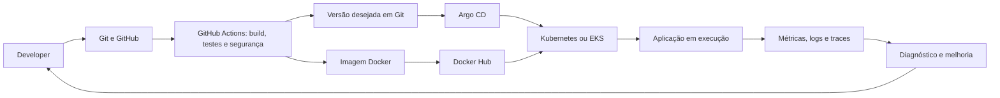

# Visão geral e mapa da formação

[Entrada do guia](README.md) · [Índice dos dias](day-index.md)

## DevOps: entregar e operar software

DevOps aproxima desenvolvimento e operações através de responsabilidade partilhada, alterações pequenas, feedback rápido e automação. O objetivo é entregar mudanças com confiança e compreender o comportamento do sistema depois do deploy. Uma coleção de ferramentas, por si só, não cria esta colaboração.

O curso começa com autonomia e disciplina no dia 01: definir objetivos, praticar e registar evidência. As revisões dos dias 12, 21, 28, 37 e 90 reforçam outro princípio: conseguir explicar e repetir uma ação vale mais do que copiar um comando.

Git torna alterações rastreáveis; integração contínua verifica mudanças; entrega contínua mantém versões prontas a instalar; infraestrutura como código torna ambientes reproduzíveis. Observabilidade fecha o ciclo com dados do sistema real. Fiabilidade significa continuar a prestar o serviço e recuperar de falhas, considerando dados, dependências e capacidade.

## Fluxo de alto nível

Terraform prepara rede e infraestrutura; Helm gera configuração Kubernetes; Ansible configura servidores no percurso de VMs. São responsabilidades complementares, não passos obrigatoriamente sequenciais de todos os deploys.

## Mapa da formação

| Área e dias | Tecnologias e conceitos | Para que serve |
| --- | --- | --- |
| Fundamentos, 01-13 | Linux, systemd, journald, SSH, Nginx, utilizadores, permissões, LVM | Operar o sistema onde as aplicações correm |
| Redes, 14-15 | OSI, TCP/IP, DNS, IPv4, CIDR, portas, HTTP/HTTPS | Localizar problemas de resolução, conectividade e acesso |
| Automação, 16-21 | Bash, processamento de texto, cron, backups e rotação de logs | Repetir tarefas e produzir diagnóstico verificável |
| Versionamento, 22-28 | Git, GitHub, gh, branches e revisão | Colaborar, preservar histórico e recuperar alterações |
| Containers, 29-37 | Docker, Compose, Docker Hub, volumes e redes | Construir e distribuir aplicações com dependências controladas |
| CI/CD e segurança, 38-49 | YAML, Actions, runners, artifacts, Trivy | Automatizar verificação, publicação e controlo de entrega |
| Kubernetes, 50-60 | kind/minikube, kubectl, Pods, Services, armazenamento, HPA, Helm | Manter workloads declarativos num cluster |
| Infraestrutura, 61-67 | Terraform, HCL, AWS, EC2, S3, VPC, EKS, estado e módulos | Provisionar e gerir recursos |
| Configuração, 68-72 | Ansible, inventários, roles, Jinja2, Galaxy e Vault | Instalar e configurar serviços repetidamente |
| Observabilidade, 73-77 | Prometheus, Grafana, Loki, Promtail, OpenTelemetry | Recolher sinais, correlacionar falhas e alertar |
| Packaging, 78-80 | Helm, charts, values, hooks, ambientes | Reutilizar configuração da AI-BankApp |
| Cloud Kubernetes, 81-83 | EKS, IAM, EBS CSI, Gateway API, Envoy, cert-manager | Integrar rede, armazenamento e identidade AWS |
| GitOps, 84-86 | Argo CD, drift, waves, App of Apps, RBAC | Reconciliar o cluster com o estado versionado |
| IA operacional, 87-89 | Ollama, LangChain/LangGraph, MCP, Claude, Temporal, KubeHealer | Assistir diagnóstico e remediação controlada |
| Consolidação, 90 | Autoavaliação, lacunas e portefólio | Relacionar competências e escolher o próximo exercício |

## Aplicações que dão contexto

- **Nginx e websites estáticos:** do processo e porta ao serviço acessível.
- **WordPress com MySQL:** rede, configuração, persistência e recuperação; o chart alternativo pode incluir MariaDB.
- **API de tarefas Flask/Postgres:** escolha local para Docker e Actions; Redis entra no exercício de cache do dia 34.
- **Notes App:** aplicação Django usada para observar métricas e logs.
- **AI-BankApp:** Spring Boot, MySQL e Ollama/TinyLlama ligam Helm, EKS, Gateway API e GitOps.
- **Workloads avariados:** testam diagnóstico e limites de remediação, distinguindo resposta de resolução.

## Fiabilidade ao longo do percurso

Build verde não prova serviço funcional. Imagem publicada não está automaticamente instalada. Pod Running pode não estar Ready. Recurso Synced pode estar Degraded. Volume persistente não é backup. Cluster em várias zonas não torna uma base de dados de réplica única altamente disponível.

Estas distinções unem os blocos: testar o resultado em cada camada, guardar evidência e conseguir voltar a um estado conhecido. As fontes chamam a vários laboratórios production-grade; aqui são modelos de estudo com lacunas explícitas em cloud, dados, segurança e disponibilidade.
